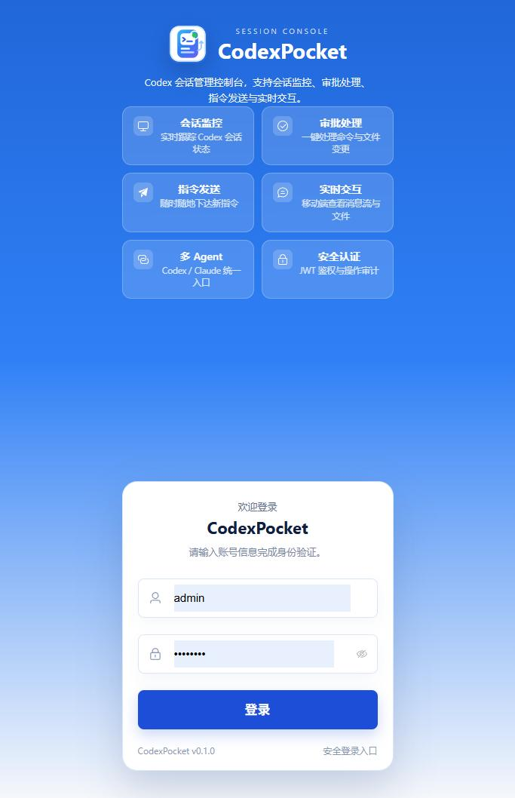
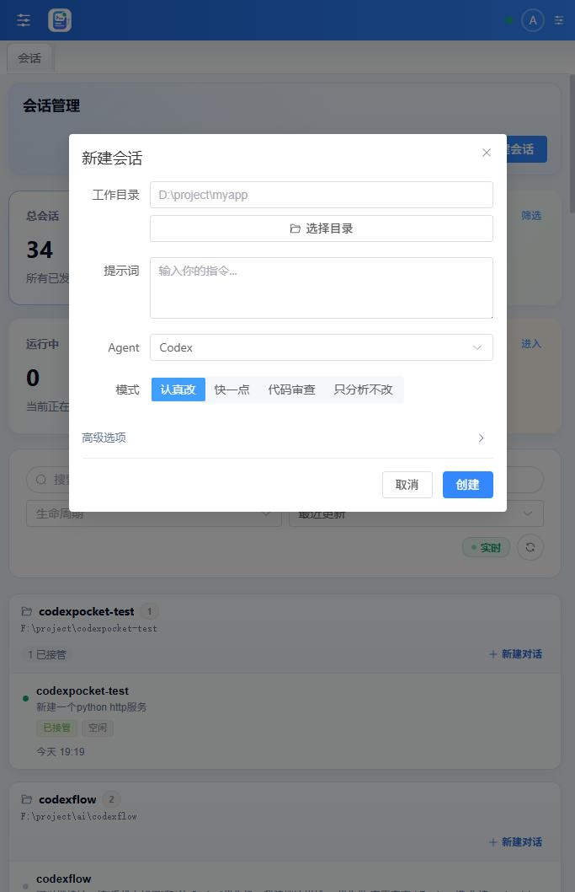
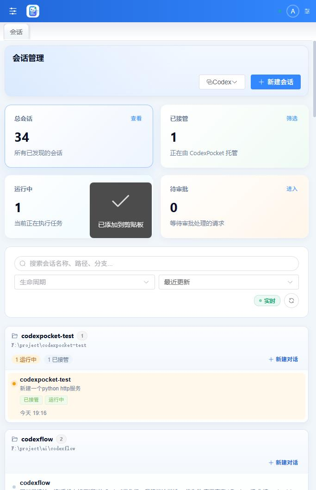
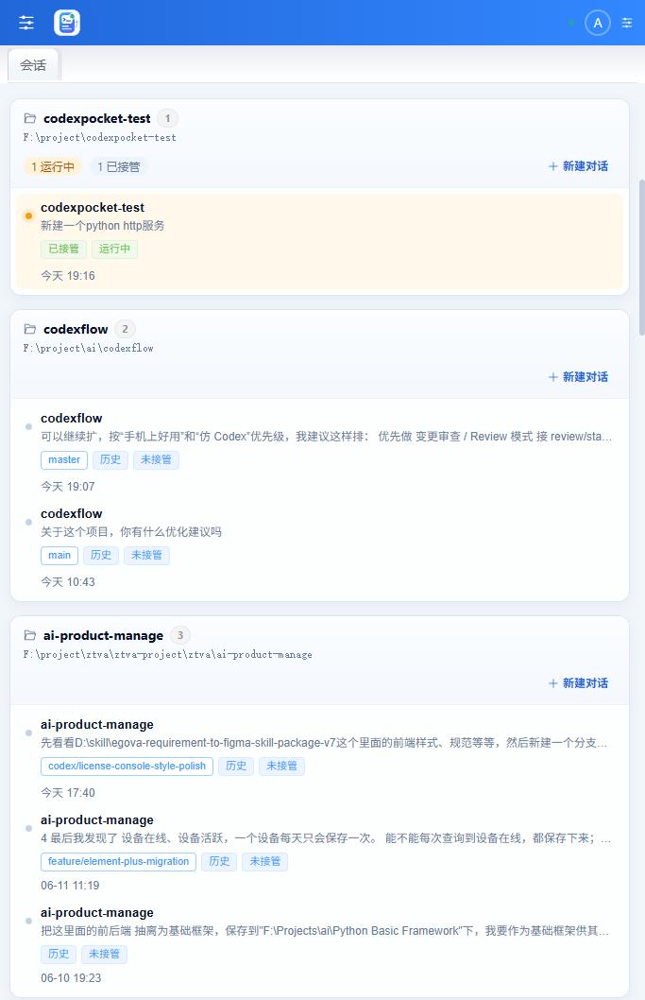
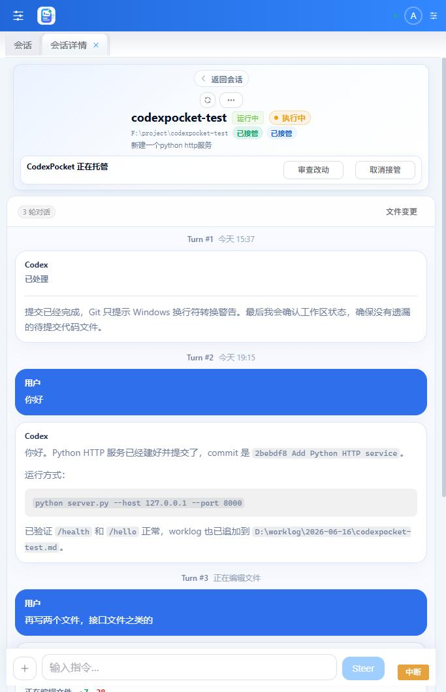
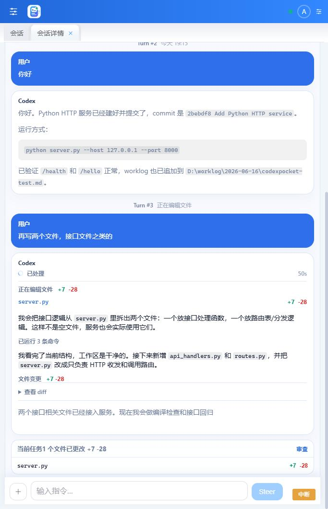
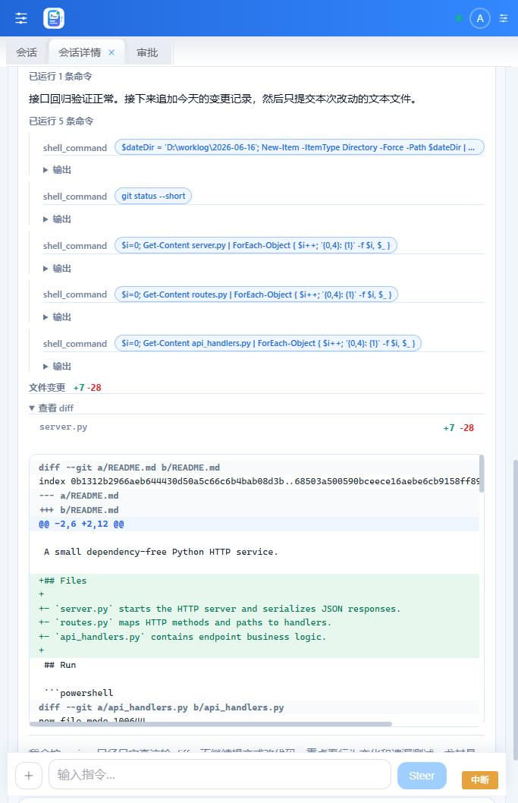
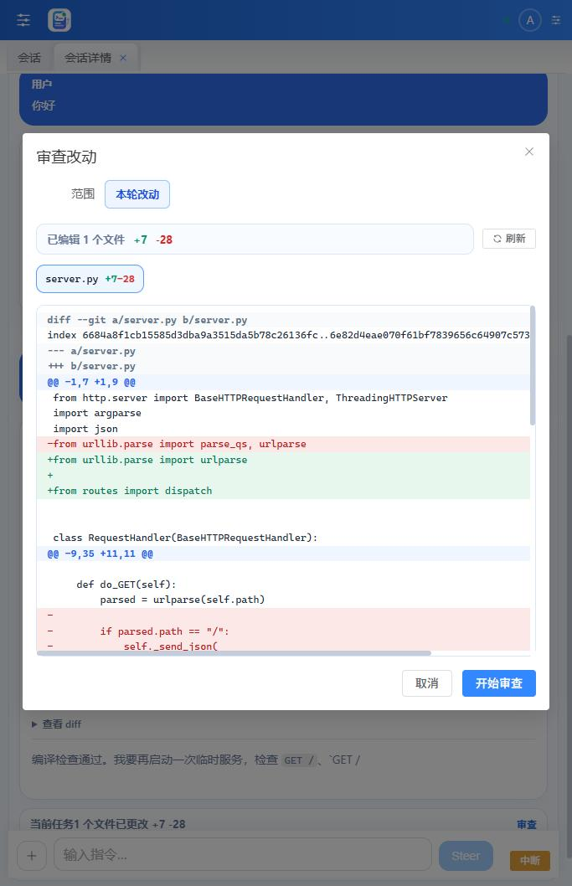
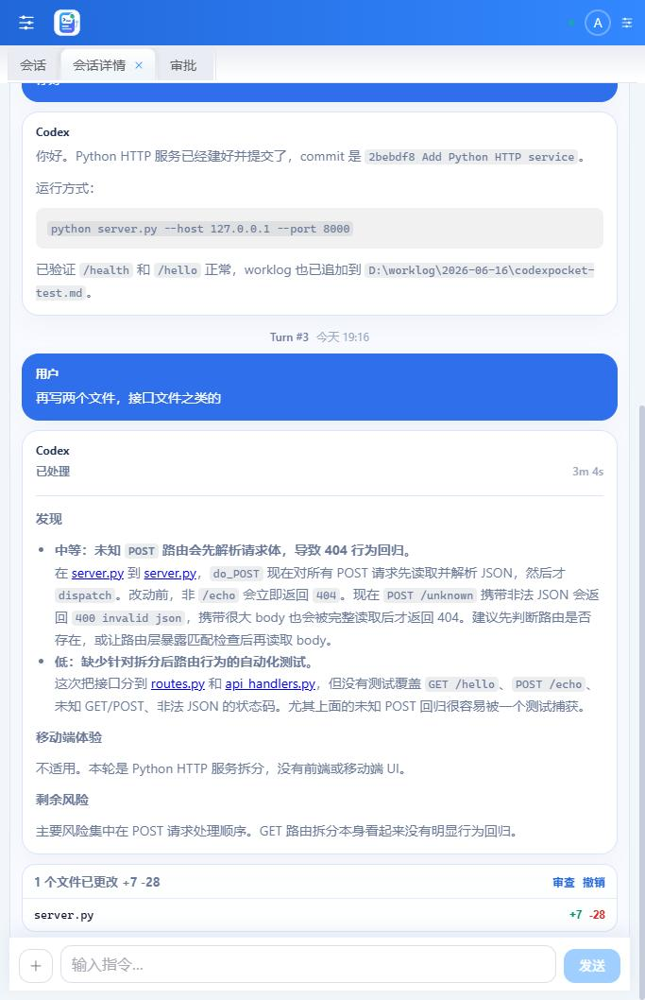

# CodexPocket

中文 | [English](README_EN.md)

CodexPocket 是一个运行在 Codex 所在电脑上的 Web 会话控制台。它把本机 Codex 会话整理成适合桌面和手机浏览器使用的界面，让你可以远程查看会话、接管任务、继续发送指令、处理中断、审查代码改动和查看过程细节。

它不是简单的终端转发页面，而是围绕 Codex app-server 的会话、turn、工具调用、文件变更、图片、审批和状态流做的一层可视化控制平面。

## 界面预览

### 登录与新建会话

<p>
  
  
</p>

### 手机端会话首页与项目目录

<p>
  
  
</p>

### 会话详情与实时处理

<p>
  
  
  
</p>

### 代码改动与会话结束

<p>
  
  
</p>

## 核心特性

- **手机优先的会话控制**：会话列表、项目分组、会话详情、输入框、过程折叠和文件变更都针对手机浏览器做了紧凑布局。
- **会话发现与接管**：自动发现本机 Codex 历史会话，按工作目录分组；未接管会话可一键接管，接管后继续发送指令。
- **实时 turn 状态**：通过 SSE 和本地 transcript 同步展示 Codex 正在思考、正在运行命令、正在编辑文件和最终总结。
- **过程折叠**：默认突出用户消息与 Codex 最终回复，中间命令、工具调用、编辑过程折叠到“已处理”区域，展开后按时间顺序查看。
- **代码改动面板**：每轮会话展示改动过的代码文件、增删行统计；可查看本轮 diff、单文件 diff，并支持审查与撤销工作区改动。
- **Review 模式**：支持审查当前工作区、指定 commit、base branch 或某轮会话改动，让手机端不用翻完整 diff 也能快速看风险。
- **目录选择器**：新建会话时可以浏览 Agent 所在电脑上的项目目录，手机上也能进入目录并选择当前目录。
- **图片输入与预览**：支持上传图片作为输入附件，会话中的图片会以缩略图展示并可放大查看。
- **命令与审批**：运行命令、审批请求、权限提示统一进入会话流和审批中心，适合远程处理卡住的任务。
- **多 Agent 接入**：当前支持 Codex app-server，并保留 Claude Code 会话发现和运行时接入能力。

## 架构

```text
Codex CLI / codex app-server
        |
        | JSON-RPC over stdio
        v
Go Agent
  - 启动并持有本机 codex app-server
  - 发现、接管、恢复和结束会话
  - 同步 turn、工具、diff、审批和目标状态
  - 暴露 HTTP API、SSE 和静态 Web 资源
        |
        | HTTP / SSE
        v
Web Console
  - 会话首页
  - 会话详情
  - 实时消息与过程折叠
  - 文件变更与 Review
  - 审批中心和设置页
```

## 快速开始

### 环境要求

- 已安装并登录 `codex` CLI
- Go 1.26+
- Node.js / npm
- Windows、macOS 或 Linux

### 后端 Agent

开发运行：

```bash
go run ./cmd/codexpocket-agent
```

构建单文件后端：

```bash
go build -o codexpocket-agent.exe ./cmd/codexpocket-agent
```

默认后端监听：

```text
0.0.0.0:7318
```

常用环境变量：

```text
CODEXPOCKET_LISTEN_ADDR       后端监听地址
CODEXPOCKET_CODEX_PATH        codex 可执行文件路径
CODEXPOCKET_CLAUDE_PATH       claude 可执行文件路径
CODEXPOCKET_JWT_SECRET        JWT 签名密钥
CODEXPOCKET_REFRESH_INTERVAL  后台刷新间隔，例如 12s
CODEXPOCKET_STATE_DB_PATH     本地状态数据库路径
CODEXPOCKET_WEB_DIST_PATH     Web Console dist 目录
CODEXPOCKET_ALLOWED_ORIGINS   允许访问 API 的来源
```

Windows 示例：

```powershell
$env:CODEXPOCKET_CODEX_PATH = "C:\path\to\codex.exe"
go run ./cmd/codexpocket-agent
```

### Web Console

开发模式：

```bash
cd web
npm install
npm run dev
```

开发服务器默认运行在：

```text
http://localhost:7319
```

`vite` 会把 `/api` 请求代理到后端 `http://127.0.0.1:7318`。

生产构建：

```bash
cd web
npm run build
```

构建产物输出到仓库根目录 `dist/`。后端启动时如果在可执行文件同级发现 `dist/`，会自动托管 Web Console。

## 基本使用

1. 启动后端 Agent，并确认 Codex CLI 已登录。
2. 启动 Web Console，打开 `http://localhost:7319`。
3. 使用配置中的账号登录，默认开发账号为 `admin / admin123`。
4. 在会话首页按项目目录查看会话，也可以选择工作目录新建会话。
5. 进入会话详情页，查看用户消息、Codex 回复、过程详情、命令和文件变更。
6. 未接管会话可点击“接管会话”，之后可以继续发送指令、追加 steer 或中断当前 turn。
7. 会话结束后可查看本轮改动文件、打开 diff、发起审查或撤销工作区改动。

## 主要页面

- **会话首页**：按项目目录分组展示会话，支持查看运行中、历史、未接管等状态。
- **新建会话**：选择工作目录，填写初始提示词，选择模型、推理强度和协作模式。
- **会话详情**：展示会话头、接管状态、turn 时间线、实时消息、工具调用、图片和文件变更。
- **文件变更**：查看工作区、commit、base branch 或指定 turn 的代码改动。
- **审批中心**：集中处理 Codex/Claude 请求的命令、文件、权限和用户输入审批。
- **设置页**：查看 Agent 状态、监听地址、Codex 路径、运行时能力和登录信息。

## API 概览

常用接口：

```text
GET    /healthz
POST   /api/v1/auth/login
GET    /api/v1/dashboard
GET    /api/v1/options
GET    /api/v1/directories
GET    /api/v1/sessions
POST   /api/v1/sessions
GET    /api/v1/sessions/:id
POST   /api/v1/sessions/:id/resume
POST   /api/v1/sessions/:id/detach
POST   /api/v1/sessions/:id/end
POST   /api/v1/sessions/:id/archive
POST   /api/v1/sessions/:id/rename
POST   /api/v1/sessions/:id/fork
POST   /api/v1/sessions/:id/compact
POST   /api/v1/sessions/:id/rollback
GET    /api/v1/sessions/:id/changes
POST   /api/v1/sessions/:id/changes/revert
POST   /api/v1/sessions/:id/review
GET    /api/v1/sessions/:id/goal
POST   /api/v1/sessions/:id/goal
DELETE /api/v1/sessions/:id/goal
POST   /api/v1/sessions/:id/turns/start
POST   /api/v1/sessions/:id/turns/steer
POST   /api/v1/sessions/:id/turns/interrupt
GET    /api/v1/approvals
POST   /api/v1/approvals/:id/resolve
POST   /api/v1/uploads/image
GET    /api/v1/assets/local-image
GET    /api/v1/events
```

## 安全建议

CodexPocket 可以控制运行 Agent 的电脑执行 Codex 操作，请按本机自动化工具来对待：

- 不要把默认账号密码暴露到公网。
- 部署到局域网或远程访问时，请修改 `CODEXPOCKET_JWT_SECRET` 和登录账号。
- 建议配合反向代理、HTTPS、访问控制或 VPN 使用。
- 对命令执行、文件撤销、审批处理等高权限操作保持谨慎。

## 开发验证

常用检查命令：

```bash
go test ./...
cd web && npm run build
git diff --check
```

开发时前端使用 `npm run dev` 热更新；后端仍是 Go 单进程服务，修改后需要重新运行或配合 `air`、`watchexec` 等工具自动重启。

## 仓库结构

```text
cmd/codexpocket-agent  Go Agent 启动入口
internal/codex         Codex app-server JSON-RPC 适配
internal/runtime       会话、turn、审批、状态和多 Agent 编排
internal/httpapi       HTTP API、SSE、认证和资源访问
internal/store         本地状态存储
web                    Vue 3 Web Console
assets/screenshots     README 截图资源
docs                   架构、生命周期和路线文档
scripts                辅助脚本
```
