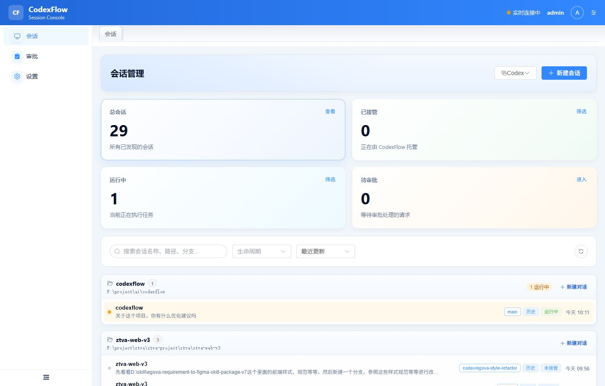
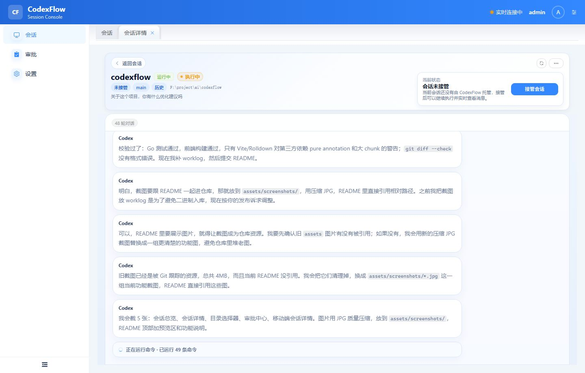
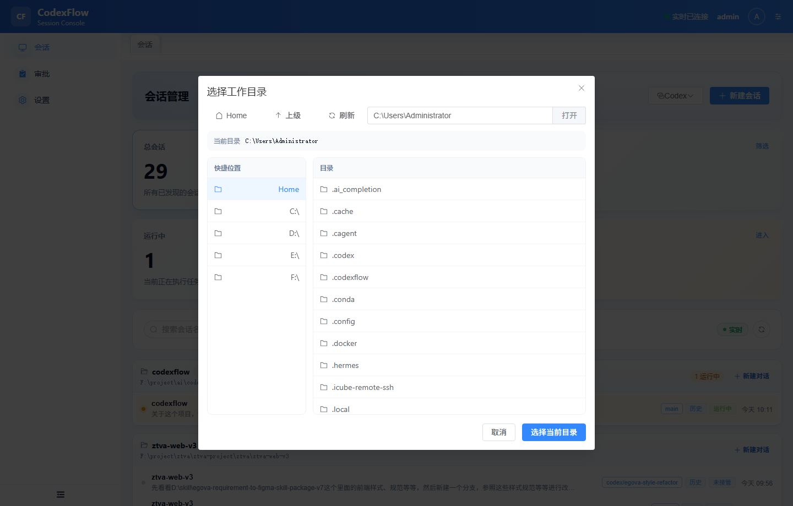
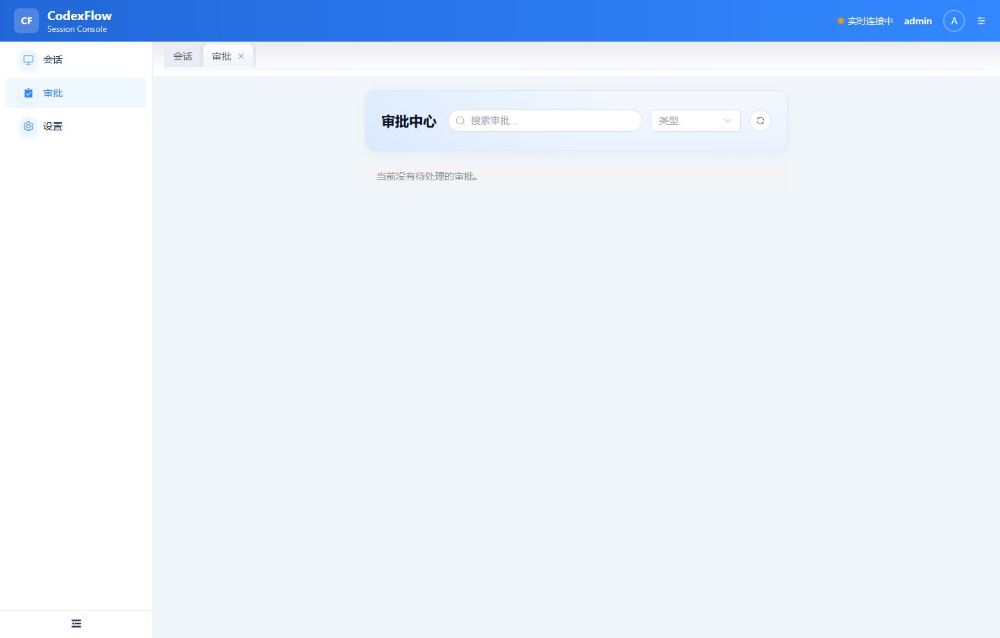
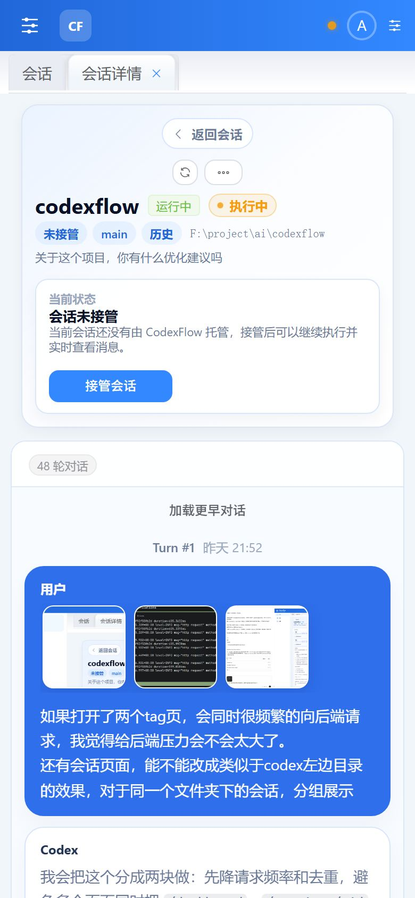
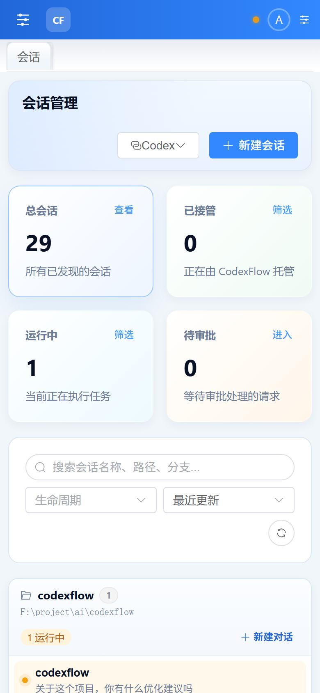
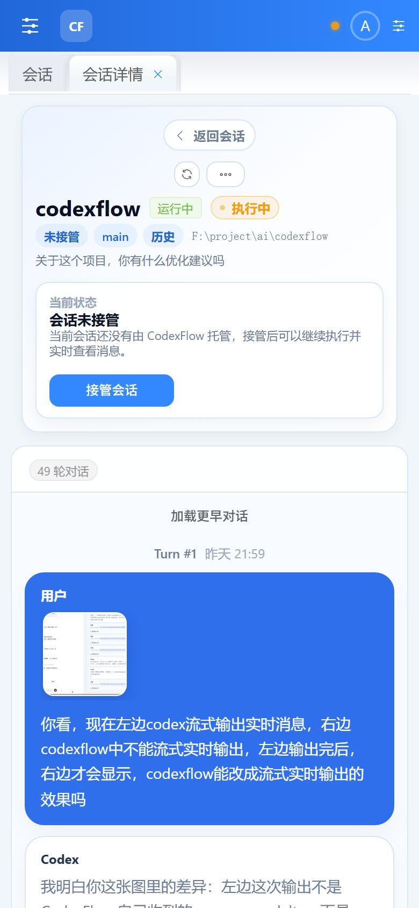
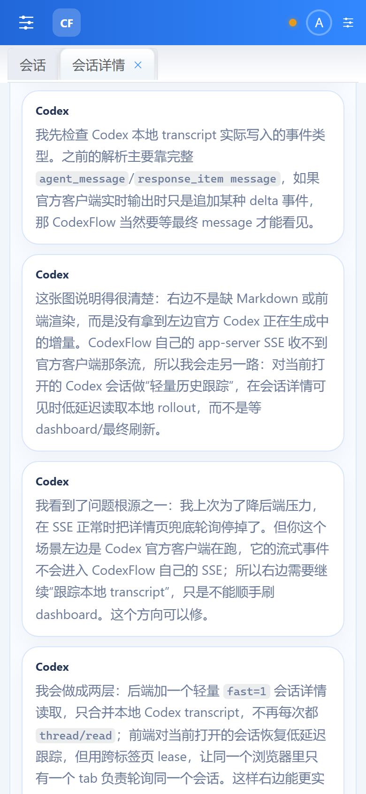
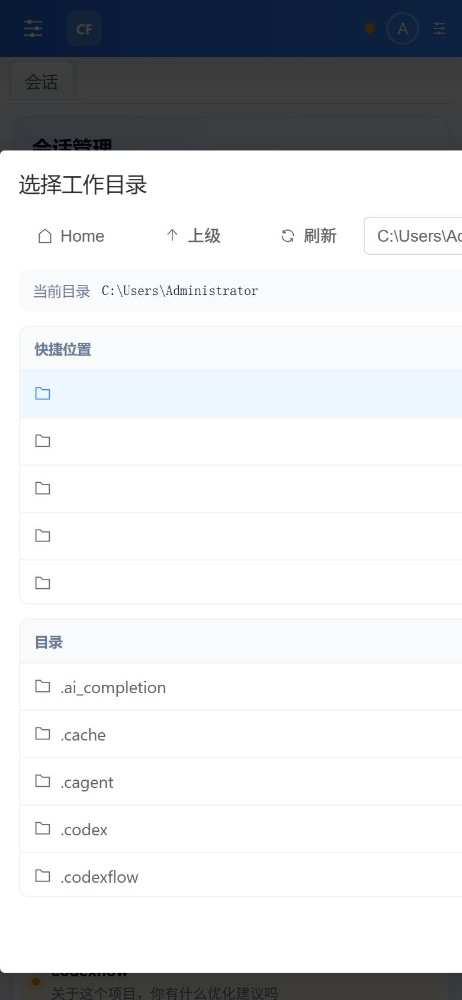
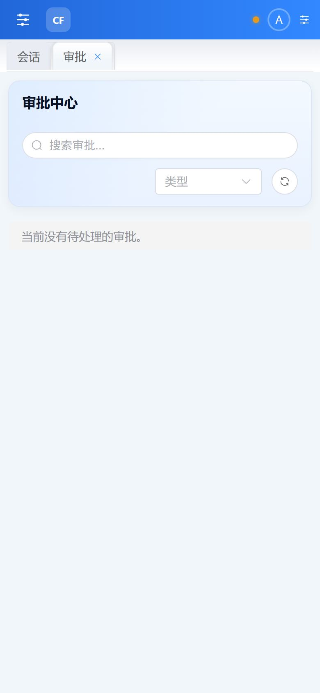

# CodexPocket

CodexPocket 是一个运行在 Codex 所在电脑上的 Web 控制台。它把本机 Codex / Claude 会话整理成浏览器和手机都能使用的控制界面，让你可以远程查看实时消息、接管会话、继续下指令、处理中断和审批。

它不是一个简单的终端转发页面，而是围绕 Codex app-server 的会话、turn、工具调用、文件变更、图片、审批和状态流做了一层可视化控制平面。

## 界面预览

### 会话总览



### 会话详情



### 工作目录选择



### 审批中心



### 移动端体验

<p>
  
  
  
</p>

<p>
  
  
  
</p>

## 核心特性

- **会话管理**：自动发现本机 Codex 历史会话，按工作目录分组展示，支持搜索、状态筛选和生命周期筛选。
- **移动端可用**：Web Console 做了响应式布局，可以在手机浏览器里查看会话、发送指令、接管、取消接管和中断任务。
- **远程接管**：对未接管会话可以一键接管；接管后 CodexPocket 可以继续发送消息、追加 steer、interrupt 当前 turn，并可取消接管回到发现状态。
- **实时消息**：通过 SSE 和轻量本地 transcript 同步追踪正在运行的会话，尽量贴近 Codex 客户端里的实时输出节奏。
- **Markdown 渲染**：用户消息和助手消息使用 Markdown 展示，代码、列表、链接、行内代码等内容保持可读。
- **图片展示**：用户输入和助手输出里的图片会以横向缩略图展示，点击可放大预览，适合手机端查看截图上下文。
- **工具调用展示**：工具消息默认折叠，`shell_command` 会直接展示命令 tag，展开后可查看原始 JSON 和输出。
- **过程折叠**：会话中的中间步骤、连续命令、正在思考、上下文压缩等过程信息会合并成轻量状态，避免刷屏。
- **文件变更**：会话结束后展示本轮修改过的文件、增删行统计和变更摘要，方便快速进入审核。
- **审批中心**：集中处理命令、文件变更、权限和用户输入类审批请求。
- **工作目录选择器**：新建会话时可以直接浏览 Codex 所在电脑上的目录，不需要手动输入路径。
- **多标签页协作**：多个浏览器标签同时打开时，会通过前端 lease 和广播机制降低重复轮询，减少后端压力。
- **多 Agent 接入**：当前支持 Codex app-server，并保留 Claude Code 会话发现和运行时接入能力。

## 架构

```text
Codex CLI / codex app-server
        |
        | JSON-RPC over stdio
        v
Go Agent
  - 启动并持有本机 codex app-server
  - 发现和接管会话
  - 同步 turn、工具、diff、审批和目标状态
  - 暴露 HTTP API、SSE 和静态 Web 资源
        |
        | HTTP / SSE
        v
Web Console
  - 会话总览
  - 会话详情
  - 实时消息
  - 审批中心
  - 设置和移动端控制
```

## 快速开始

### 环境要求

- 已安装并登录 `codex` CLI
- Go 1.26+
- Node.js / npm
- Windows、macOS 或 Linux

### 后端 Agent

开发运行：

```bash
go run ./cmd/codexpocket-agent
```

构建单文件后端：

```bash
go build -o codexpocket-agent.exe ./cmd/codexpocket-agent
```

默认后端监听：

```text
0.0.0.0:7318
```

常用环境变量：

```text
CODEXPOCKET_LISTEN_ADDR       后端监听地址
CODEXPOCKET_CODEX_PATH        codex 可执行文件路径
CODEXPOCKET_CLAUDE_PATH       claude 可执行文件路径
CODEXPOCKET_JWT_SECRET        JWT 签名密钥
CODEXPOCKET_REFRESH_INTERVAL  后台刷新间隔，例如 12s
CODEXPOCKET_STATE_DB_PATH     本地状态数据库路径
CODEXPOCKET_WEB_DIST_PATH     Web Console dist 目录
CODEXPOCKET_ALLOWED_ORIGINS   允许访问 API 的来源
```

Windows 示例：

```powershell
$env:CODEXPOCKET_CODEX_PATH = "C:\path\to\codex.exe"
go run ./cmd/codexpocket-agent
```

### Web Console

开发模式：

```bash
cd web
npm install
npm run dev
```

开发服务器默认运行在：

```text
http://localhost:7319
```

`vite` 会把 `/api` 请求代理到后端 `http://127.0.0.1:7318`。

生产构建：

```bash
cd web
npm run build
```

构建产物输出到仓库根目录 `dist/`。后端启动时如果在可执行文件同级发现 `dist/`，会自动托管 Web Console。

## 基本使用

1. 启动后端 Agent，并确认 Codex CLI 已经登录。
2. 启动 Web Console，打开 `http://localhost:7319`。
3. 使用配置中的账号登录，默认开发账号为 `admin / admin123`。
4. 在"会话"页面查看按工作目录分组的会话列表。
5. 点击某个会话进入详情页，查看历史消息、图片、工具调用和文件变更。
6. 对未接管会话点击"接管会话"，接管后即可继续发送指令。
7. 会话运行中可以追加指令、查看实时输出、处理中断或审批请求。

## 主要页面

- **会话总览**：统计总会话、已接管、运行中、待审批，并按工作目录展示会话。
- **会话详情**：展示当前会话头、接管状态、turn 时间线、实时消息、工具调用、图片和文件变更。
- **审批中心**：集中处理 Codex/Claude 请求的命令、文件、权限和用户输入审批。
- **设置页**：查看 Agent 状态、监听地址、Codex 路径、运行时能力和登录信息。

## API 概览

常用接口：

```text
GET    /healthz
POST   /api/v1/auth/login
GET    /api/v1/dashboard
GET    /api/v1/directories
GET    /api/v1/sessions
POST   /api/v1/sessions
GET    /api/v1/sessions/:id
POST   /api/v1/sessions/:id/resume
POST   /api/v1/sessions/:id/detach
POST   /api/v1/sessions/:id/end
POST   /api/v1/sessions/:id/archive
POST   /api/v1/sessions/:id/rename
POST   /api/v1/sessions/:id/fork
POST   /api/v1/sessions/:id/compact
POST   /api/v1/sessions/:id/rollback
GET    /api/v1/sessions/:id/goal
POST   /api/v1/sessions/:id/goal
DELETE /api/v1/sessions/:id/goal
POST   /api/v1/sessions/:id/turns/start
POST   /api/v1/sessions/:id/turns/steer
POST   /api/v1/sessions/:id/turns/interrupt
GET    /api/v1/approvals
POST   /api/v1/approvals/:id/resolve
POST   /api/v1/uploads/image
GET    /api/v1/assets/local-image
GET    /api/v1/events
```

## 安全建议

CodexPocket 可以控制运行 Agent 的电脑执行 Codex 操作，请按本机自动化工具来对待：

- 不要把默认账号密码暴露到公网。
- 部署到局域网或远程访问时，请修改 `CODEXPOCKET_JWT_SECRET` 和登录账号。
- 建议配合反向代理、HTTPS、访问控制或 VPN 使用。
- 不要提交 `codexpocket.yaml`、数据库、构建产物、exe 等本地文件；README 截图请放在 `assets/screenshots/` 并压缩后再入库。

## 开发验证

常用检查命令：

```bash
go test ./...
cd web && npm run build
git diff --check
```

开发时前端使用 `npm run dev` 热更新；后端仍是 Go 单进程服务，修改后需要重新运行或配合 `air`、`watchexec` 等工具自动重启。

## 仓库结构

```text
cmd/codexpocket-agent  Go Agent 启动入口
internal/codex         Codex app-server JSON-RPC 适配
internal/runtime       会话、turn、审批、状态和多 Agent 编排
internal/httpapi       HTTP API、SSE、认证和资源访问
internal/store         本地状态存储
web                    Vue 3 Web Console
docs                   架构、生命周期和路线文档
scripts                辅助脚本
```
